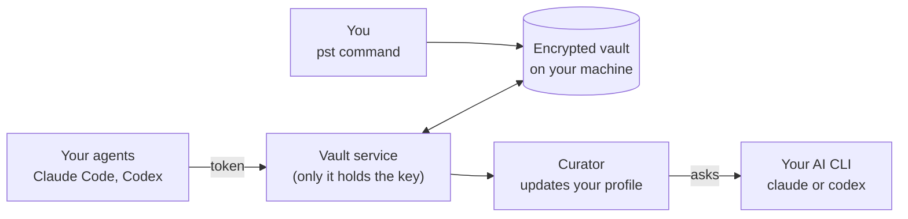

# ADR 001: How personalitystore works

author: @raashidanwar
created: 08-10-2026
status: approved

## Motivation

Every AI agent you use starts out knowing nothing about you. Claude Code doesn't know what Codex learned.
Your shopping agent doesn't know your shoe size. Each one keeps its own memory, if it keeps any at all, and
you can't see it, fix it or take it with you.

personalitystore gives you one place for all of that: your personality, your personal details and your tastes,
plus a diary of what you did. You own it, it's encrypted, and your agents can read it, but only the parts you
allow. It also keeps itself up to date, so you never have to maintain it by hand.

## Goals

- **One memory for all your agents.** Claude Code, Codex and any other MCP-compatible agent read the same
  profile.
- **Yours and private.** It lives on your machine, encrypted, and only you hold the key.
- **Each agent sees only what it needs.** Every agent gets its own token. You choose what each one can read
  or write, and you can take access back at any time.
- **A daily logbook.** Agents write down what you did ("bought black sneakers", "rejected the leather
  jacket"), one file per day, with timestamps.
- **A profile that updates itself.** Every 6 hours (you can change this), the vault reads the new logbook
  entries and updates your tastes and profile. If your laptop was off, it catches up the next time an agent
  starts.
- **Easy to install and update.** One command installs it, and `pst upgrade` keeps it current. You don't need
  to install anything else.

## Non-goals

- **Sharing with other people's agents.** For now, only your own agents can use the vault.
- **A hosted service.** There are no accounts and no cloud sign-up: one vault per person.
- **Protection from malware on your computer.** If something malicious runs as your user account, it could
  get the key. Tokens keep honest agents in their lane, but they're not a sandbox.
- **Smart search.** Agents read whole documents and filter the logbook by date, tag or text.
- **Windows.** macOS and Linux only, for now.

## How it works



There are four moving parts:

1. **The vault** is a folder of encrypted files on your machine.
2. **The vault service** is a small background program and the only thing that can unlock the vault. It
   starts when you log in.
3. **Your agents** connect to the service through MCP, the standard way agents plug in tools. Each agent has
   its own token, and the service checks that token on every request.
4. **The curator** runs inside the service. It reads new logbook entries and updates your profile, using
   Claude or Codex behind the scenes.

### What's inside the vault

```
personality/   how you think, talk and work      e.g. communication.md
details/       facts about you                   e.g. sizes.md
taste/         what you like, per topic          e.g. food.md, fashion/shoes.md
logbook/       what you did, one file per day    e.g. 2026/10/2026-10-08
```

A logbook entry looks like this:

```json
{ "ts": "2026-10-08T21:39", "agent": "claude-code", "action": "purchased",
  "item": "Nike Pegasus 41", "details": { "size": "10" }, "tags": ["fashion/shoes"] }
```

### A typical day

1. You open Claude Code. It starts the vault's MCP server, which tells the vault "an agent is here".
2. You ask for running shoes. Claude reads `taste/fashion/shoes` and sees that you like minimal, dark
   sneakers in size 10.
3. You buy a pair. Claude adds that to today's logbook.
4. If 6 hours have passed since the last update, the curator reads the new entries, updates
   `taste/fashion/shoes`, and keeps the old version just in case.

## Key decisions

| We chose | Because |
| --- | --- |
| Plain encrypted files instead of a database | Easy to back up and inspect, and nothing extra to install. |
| AES-256-GCM encryption, with the key in macOS Keychain | Strong, standard encryption with the key kept outside the vault folder. Servers can supply the key through an environment variable instead. |
| One token per agent, limited to certain folders and actions | Least access by default, easy to revoke, and every use is logged. |
| Only the vault service holds the key | Agents never touch the key, only their token. |
| The curator runs every 6 hours and catches up when an agent starts | Keeps the profile fresh without slowing your agents down. It remembers exactly where it stopped. |
| Use your own `claude` or `codex` CLI for the curator | No extra API key needed. A local model works too. |
| Only your own agents, for now | Sharing with third parties raises hard privacy problems. We'll solve those later. |
| Bun and TypeScript, shipped as a single binary | One file to install, with no runtime to manage. |

## Security in short

- **Protected:**
  - Files are unreadable without the key.
  - Tampered or swapped files are rejected.
  - Agents can only touch what their token allows, and every access is written to an audit log.
  - Downloads from `install.sh` and `pst upgrade` are checked against published checksums.
- **Not protected:**
  - File names (like `taste/food`) are visible.
  - Malware running as you could ask the Keychain for the key.
- **Leaves your machine:** when the curator runs, it sends new logbook entries and your current profile to
  the AI provider you picked (Anthropic or OpenAI). Choose a local model if you want everything to stay on
  your machine.

## Trade-offs

- The vault service has to be running for agents to use the vault. On macOS, `pst service install` handles
  this.
- How good the profile is depends on the AI model the curator uses.
- The curator rewrites documents automatically. Old versions are kept (the last 20), but there's no review
  step yet.
- Each binary is 60–80 MB because it includes the Bun runtime.

## What's next

- Let trusted third-party agents (like a store's shopping agent) see a small, limited slice of your profile.
- Learn from Claude Code and Codex sessions automatically, not just from the logbook.
- Run the vault on a server or in the cloud, with TLS.
- Hide file names, and let you review the curator's changes before they're saved.
- Choose a license for the repository.
